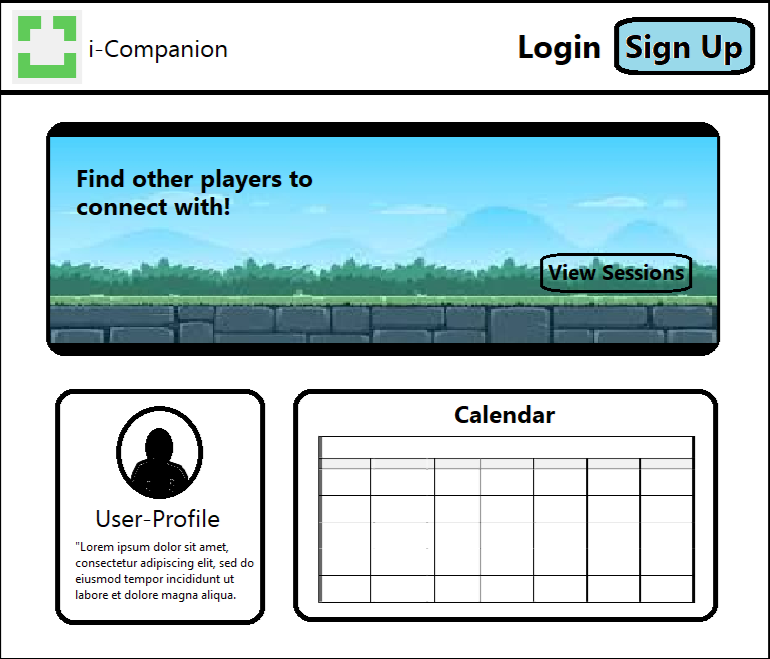

<!--

# iCompanion

## Table of contents

## Team Members

## Overview

## User Guide

### Landing Page

### Sign in and sign up

### Home page

-->
## Content
- [Overview](#Overview)
- [Landing Page](#LandingPage)
- [User Guide](#UserGuide)
- [Overview](#Overview)
- [Overview](#Overview)

## Overview

Problem: Many students that come to the ilab, especially during the first couple weeks of school, are trying to make friends but end up playing games alone. 

Solution: We make an application that sorts students using similar available times, games played, etc and match them with each other making the process of forming connections and making friends easier.

## Landing Page

## User Guide

Provide at least one screen shot of every page. This section should provide enough detail for a user to get up and running with your system (you can provide further help within the application itself).

## Developer Guide

How to download, install, and run the system locally, as well as how to deploy it.

## Development history

Explains the trajectory of development of the system: what was accomplished during each milestone.

## Team Members

Explains who the developers of the system are and how to get in touch with them if you have comments or questions.

## Team Contract

[Link to Team Contract](https://docs.google.com/document/d/1fk9-8-RfUI3wKC04T7Q8dusIydw-vxO_euXqXWyy_ng/edit?usp=sharing) (will open in Google Docs).

