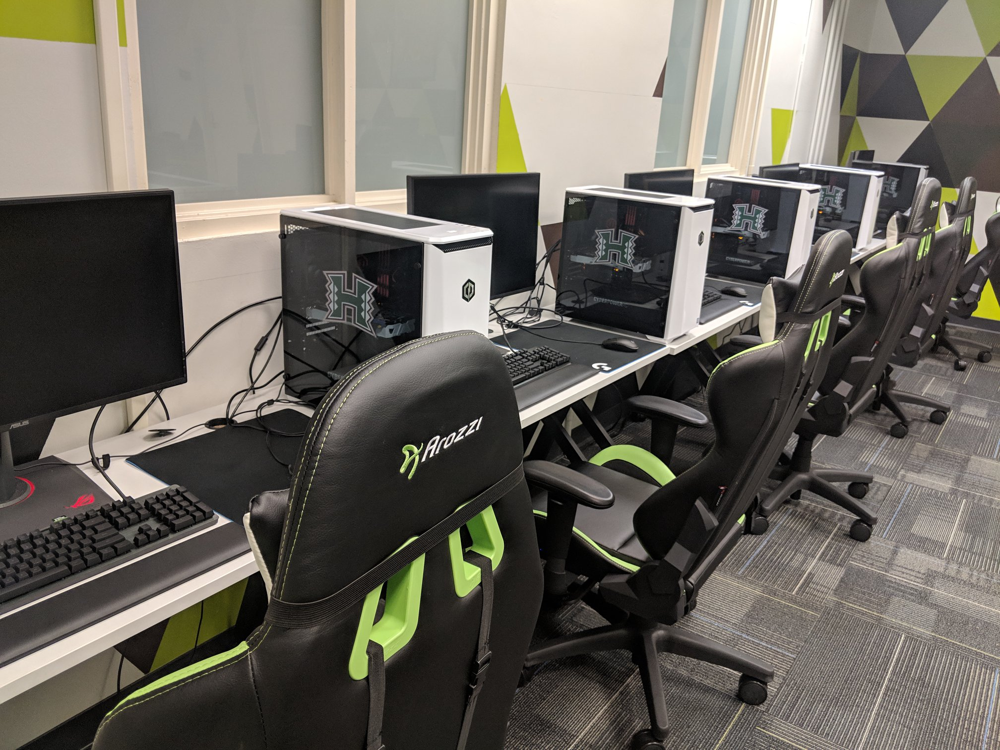
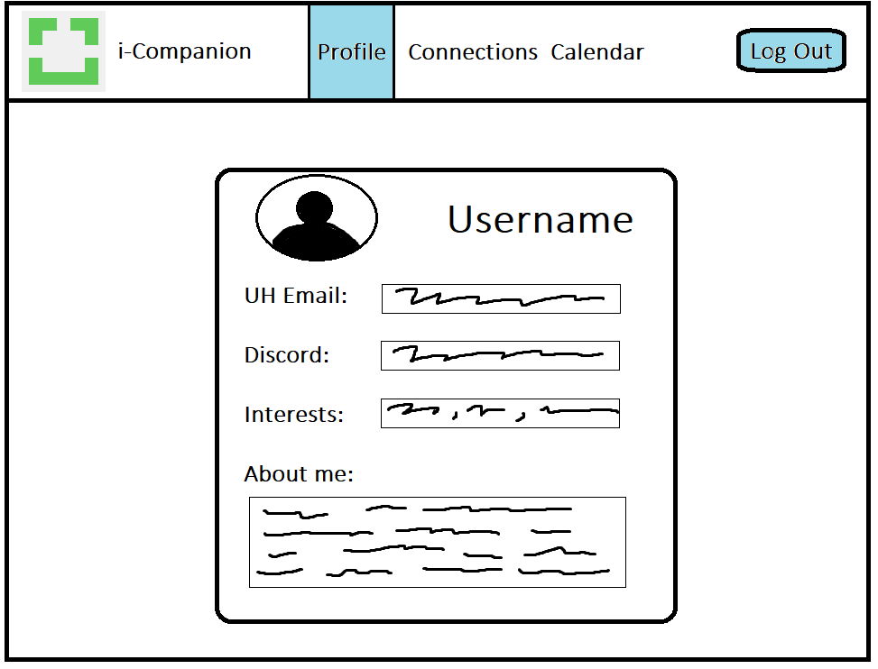
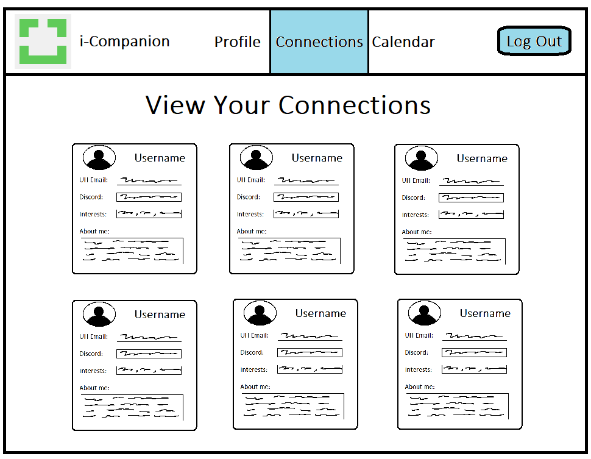
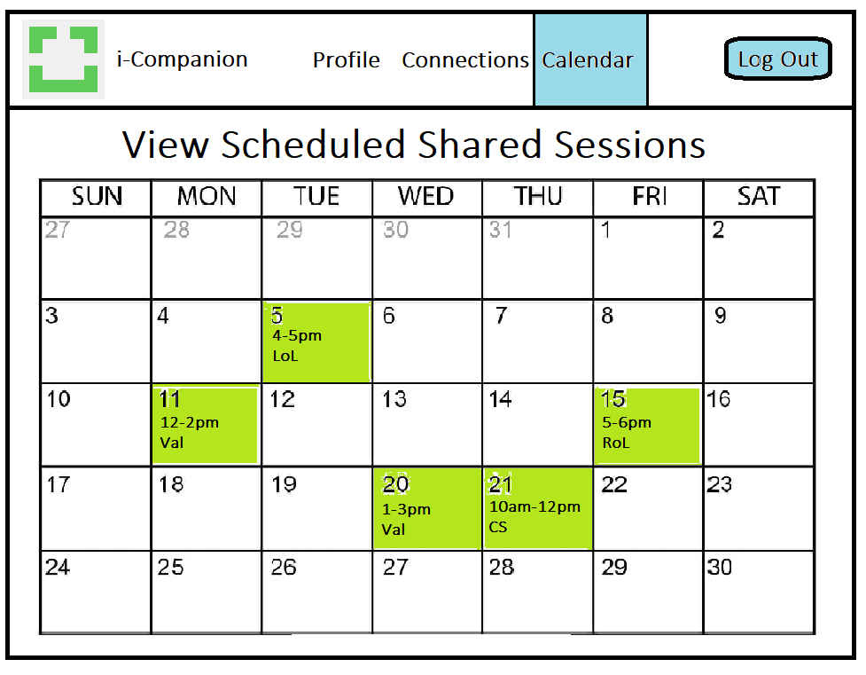

<!--

# iCompanion

## Table of contents

## Team Members

## Overview

## User Guide

### Landing Page

### Sign in and sign up

### Home page

-->
<link rel="stylesheet" href="/Design/style.css">

## Content
- [Overview](#overview)
- [User Guide](#user-guide)
- [Team Contract](#team-contract)

## Overview

The iLab is a gaming lounge on the campus of UH Manoa for UH Mānoa students, faculty and staff, and is open on weekdays 10:30 a.m.–6 p.m. Members are able to to come and game, learn about esports, and meet other people who are interested in esports. It is also a great place to relax and destress with your friends as the semester progresses.

There are many students that come to the ilab, especially during the first couple weeks of school, that don't have anyone to play with as most of their usual friends may not go to UH. It may be easier to enjoy your time at the iLab lounge if you are able to make new groups, meet new friends, and learn more about the community by being a part of it.

The iCompanion web application sorts UH students using similar, interests, available times, etc and connects them with each other, allowing for the process of forming connections and making friends easier.

## User Guide

The landing page allows the user to sign-in or create their account using their UH email as their username. It also displays and example of the other pages once the user signs in.

Once signed in, the user can add or edit their profile details. These include their username, contact details such as discord or in-game usernames, and a short description of their interests / what they like to play.

Using their interests, the application can suggest new users to connect and interact with within iLabs.

A calendar view can also be shown of all of the scheduled gaming sessions in iLabs that were made public by the organizer.

## Team Contract

[Link to Team Contract](https://docs.google.com/document/d/1fk9-8-RfUI3wKC04T7Q8dusIydw-vxO_euXqXWyy_ng/edit?usp=sharing) (will open in Google Docs).
